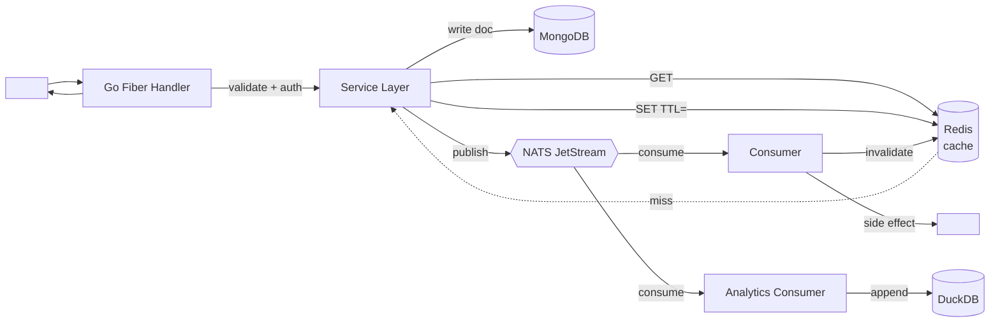
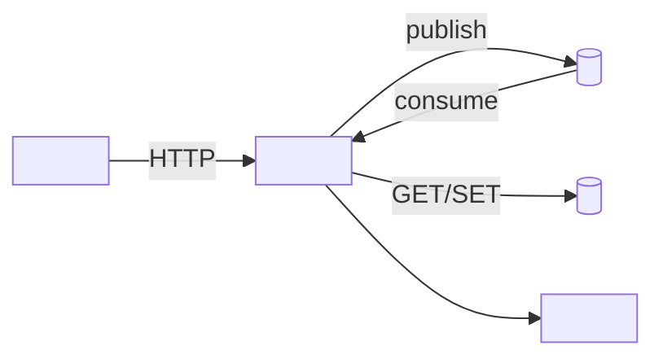

# Design: <title>

> Author order: fill **Pre-Implementation Specs** first. No referenced task may start until every box in that section is checked.

## Pre-Implementation Specs

Purpose: Lock the cross-cutting contracts and operational guardrails for this design before any task that references it is started. Tasks must not begin until every box below is checked, with the linked artifact frozen at a named version.

### Lock Checklist

- [ ] **Data contracts** — MongoDB collections, Redis keys, DuckDB tables, and NATS subjects with field types, indexes, and retention are frozen in `<PLACEHOLDER: link to schema doc / .proto / .ts types>` at version `<PLACEHOLDER: vX.Y>`.
- [ ] **API contracts** — Fiber routes and Next.js route handlers documented with request/response shapes, status codes, and pagination rules in `<PLACEHOLDER: link to OpenAPI / API.md>`; example payloads attached.
- [ ] **Error model** — Canonical error codes, HTTP/NATS mapping, retry semantics, and user-facing copy defined in `<PLACEHOLDER: link to errors.md>`; covers `<PLACEHOLDER: top 5 failure modes>`.
- [ ] **Auth model** — AuthN method, AuthZ rules per route/subject, session/token lifetime, and Shadcn UI gating defined in `<PLACEHOLDER: link to auth.md>`; threat-modeled against `<PLACEHOLDER: roles list>`.
- [ ] **Observability hooks** — Required logs, metrics, and traces (names + labels) declared in `<PLACEHOLDER: link to telemetry.md>`; dashboards and alerts stubbed in `<PLACEHOLDER: dashboard URL>`.
- [ ] **Feature-flag plan** — Flag names, default values, owner, and kill-switch path defined in `<PLACEHOLDER: link to flags.md>`; flag wired on both Next.js and Fiber sides before merge.
- [ ] **Rollout / rollback plan** — Phased rollout cohorts, success metrics, and one-command rollback documented in `<PLACEHOLDER: link to rollout.md>`; rollback rehearsed in `<PLACEHOLDER: env>`.
- [ ] **Performance budget** — p50/p95 latency, throughput, cache hit-rate, and Redis/DuckDB query targets fixed in `<PLACEHOLDER: link to perf-budget.md>`; load test plan referenced.
- [ ] **Accessibility budget** — WCAG level, keyboard/SR coverage, color-contrast, and Shadcn component audit scope fixed in `<PLACEHOLDER: link to a11y-budget.md>`; lint/CI checks enabled.
- [ ] **Security threat model link** — STRIDE (or equivalent) review for this design completed and linked at `<PLACEHOLDER: link to threat-model.md>`; mitigations tracked as tasks `<PLACEHOLDER: IDs>`.

### Sign-off

```yaml
locked_at: <PLACEHOLDER: YYYY-MM-DD>
locked_by: <PLACEHOLDER: architect handle>
design_version: <PLACEHOLDER: vX.Y>
unblocks_tasks: [<PLACEHOLDER: TASK-IDs>]
```

**How to fill:** Replace every `<PLACEHOLDER>` with a real link or value, then tick each box only when its definition of done is satisfied; do not open tasks until the Sign-off block is complete.

## Solution Architecture

Purpose: High-level component view of the system for this design — shows the boxes, their boundaries, and how requests/events flow between them so reviewers can reason about coupling, scaling, and failure domains at a glance.

### Block Diagram

```text
          ┌────────────────────┐
          │  Web (Next.js +    │
          │  Shadcn UI)        │
          └─────────┬──────────┘
                    │ HTTPS / RSC
                    ▼
          ┌────────────────────┐        ┌────────────────────┐
          │  API (Go + Fiber)  │◄──────►│  Cache (Redis)     │
          │  <PLACEHOLDER:svc> │  r/w   │  <PLACEHOLDER:keys>│
          └───┬───────────┬────┘        └────────────────────┘
              │           │
       pub/sub│           │ CRUD
              ▼           ▼
   ┌────────────────┐  ┌────────────────────┐
   │  Bus (NATS)    │  │  OLTP (MongoDB)    │
   │ <PLACEHOLDER:  │  │ <PLACEHOLDER:      │
   │  subjects>     │  │  collections>      │
   └───────┬────────┘  └─────────┬──────────┘
           │ events              │ CDC / ETL
           ▼                     ▼
                 ┌────────────────────────┐
                 │  OLAP (DuckDB)         │
                 │  <PLACEHOLDER:marts>   │
                 └────────────────────────┘
```

### Components

- **Web (Next.js / Shadcn)** — Responsibility: `<PLACEHOLDER: user-facing surfaces, SSR/RSC scope>` · Owner: `<PLACEHOLDER: team>` · Scaling axis: `<PLACEHOLDER: edge replicas / per-route>`
- **API (Go / Fiber)** — Responsibility: `<PLACEHOLDER: domain endpoints, auth, orchestration>` · Owner: `<PLACEHOLDER: team>` · Scaling axis: `<PLACEHOLDER: stateless horizontal pods>`
- **Bus (NATS)** — Responsibility: `<PLACEHOLDER: async events, fan-out subjects, JetStream streams>` · Owner: `<PLACEHOLDER: team>` · Scaling axis: `<PLACEHOLDER: partitions / consumer groups>`
- **Cache (Redis)** — Responsibility: `<PLACEHOLDER: hot reads, rate-limits, session/idempotency keys>` · Owner: `<PLACEHOLDER: team>` · Scaling axis: `<PLACEHOLDER: cluster shards / read replicas>`
- **OLTP (MongoDB)** — Responsibility: `<PLACEHOLDER: source-of-truth collections, indexes>` · Owner: `<PLACEHOLDER: team>` · Scaling axis: `<PLACEHOLDER: replica set / sharded by key>`
- **OLAP (DuckDB)** — Responsibility: `<PLACEHOLDER: analytical marts, reporting queries>` · Owner: `<PLACEHOLDER: team>` · Scaling axis: `<PLACEHOLDER: vertical / per-tenant file>`

> How to fill: Replace each `<PLACEHOLDER:…>` with the concrete name/scope for this design, then prune any box that isn't used and add arrows for any new external dependency (3rd-party API, object store, etc.).

## Business Workflow

Describes the user- or operator-facing process this design supports, end-to-end, so engineering, QA, and ops share one mental model of the happy path.

### Scope
- **Primary actor(s):** <PLACEHOLDER: e.g., End User, Ops Admin>
- **Entry point:** <PLACEHOLDER: page/route/CLI/event>
- **Success outcome:** <PLACEHOLDER: state change visible to the actor>
- **Out of scope:** <PLACEHOLDER: adjacent flows intentionally excluded>

### Steps (Happy Path)
1. **Actor:** <PLACEHOLDER> — **Trigger:** <PLACEHOLDER action/event> — **Outcome:** <PLACEHOLDER observable result>
2. **Actor:** <PLACEHOLDER> — **Trigger:** <PLACEHOLDER> — **Outcome:** <PLACEHOLDER>
3. **Actor:** <PLACEHOLDER> — **Trigger:** <PLACEHOLDER> — **Outcome:** <PLACEHOLDER>
4. **Actor:** <PLACEHOLDER> — **Trigger:** <PLACEHOLDER> — **Outcome:** <PLACEHOLDER>
5. **Actor:** <PLACEHOLDER> — **Trigger:** <PLACEHOLDER> — **Outcome:** <PLACEHOLDER final state / notification>

### Sequence Diagram — Happy Path

```mermaid
sequenceDiagram
    autonumber
    actor Actor as <PLACEHOLDER Actor>
    participant Web as Web (Next.js + Shadcn)
    participant API as API (Go + Fiber)
    participant Downstream as <PLACEHOLDER: MongoDB / NATS / Redis / DuckDB>

    Actor->>Web: <PLACEHOLDER: UI action>
    Web->>API: <PLACEHOLDER: HTTP request / RPC>
    API->>Downstream: <PLACEHOLDER: query / publish / cache op>
    Downstream-->>API: <PLACEHOLDER: result / ack>
    API-->>Web: <PLACEHOLDER: response payload>
    Web-->>Actor: <PLACEHOLDER: rendered confirmation>
```

### Alternate & Error Paths
- <PLACEHOLDER: validation failure → user-facing message>
- <PLACEHOLDER: downstream timeout → retry / fallback>
- <PLACEHOLDER: auth/permission denied → redirect / 403>

> **How to fill:** Name the actor and outcome first, then write 3–7 numbered steps in business language (no internals); mirror those steps as messages in the Mermaid diagram, picking only the Downstream components this design actually touches.

## System Workflow

Purpose: Describe the internal technical flow for <FEATURE_NAME>, including the synchronous request path and asynchronous event propagation across NATS, Redis, MongoDB, and DuckDB. This is the contract Dev and DevOps agents implement and operate against.

### Flow Diagram



### Step-by-Step

1. <STEP_1_SYNC_REQUEST>
2. <STEP_2_CACHE_LOOKUP>
3. <STEP_3_PERSIST_MONGO>
4. <STEP_4_PUBLISH_EVENT>
5. <STEP_5_CONSUMER_SIDE_EFFECT>
6. <STEP_6_ANALYTICS_WRITE>

### Reliability Controls

- **Sync timeout**: handler budget `<HANDLER_TIMEOUT_MS>` ms; downstream calls `<DOWNSTREAM_TIMEOUT_MS>` ms.
- **Retries**: Fiber -> Mongo `<MONGO_RETRIES>` with `<BACKOFF_POLICY>`; NATS publish `<PUBLISH_RETRIES>`; consumer redelivery max `<MAX_DELIVER>` then DLQ `<DLQ_SUBJECT>`.
- **Idempotency**: request header `Idempotency-Key: <KEY_FORMAT>`, stored in Redis `idem:<KEY>` for `<IDEM_TTL>`; event `Nats-Msg-Id: <EVENT_ID_FORMAT>` for JetStream dedupe window `<DEDUPE_WINDOW>`.
- **Cache policy**: key `<CACHE_KEY_PATTERN>`, TTL `<TTL>`, invalidation on `<INVALIDATION_TRIGGER>`.
- **Ordering / partitioning**: NATS subject partitioned by `<PARTITION_KEY>`; DuckDB writes batched every `<BATCH_INTERVAL>` or `<BATCH_SIZE>` rows.
- **Failure modes**: <FAILURE_MODE_1>, <FAILURE_MODE_2> -> mitigated by <MITIGATION>.

How to fill: replace every `<PLACEHOLDER>` with the concrete subject names, collections, keys, and numeric budgets for this design; keep the diagram in sync with the Step-by-Step list so Dev and Tester agents read one consistent flow.

## ER Diagram

Defines the primary entities for this design, their attributes and relationships, and where each entity physically lives across MongoDB, DuckDB, and Redis. Acts as the contract between the data model and the storage routing decisions downstream.

### Entities & Relationships

```mermaid
erDiagram
    <ENTITY_A> ||--o{ <ENTITY_B> : "<RELATION_VERB>"
    <ENTITY_B> }o--|| <ENTITY_C> : "<RELATION_VERB>"

    <ENTITY_A> {
        <TYPE> <id_field> PK
        <TYPE> <attribute_1>
        <TYPE> <attribute_2>
        <TYPE> <created_at>
    }
    <ENTITY_B> {
        <TYPE> <id_field> PK
        <TYPE> <entity_a_id> FK
        <TYPE> <attribute_1>
    }
    <ENTITY_C> {
        <TYPE> <id_field> PK
        <TYPE> <attribute_1>
    }
```

### Storage Routing

| Entity | MongoDB Collection | DuckDB Table | Redis Key Pattern | PII / Retention |
|---|---|---|---|---|
| `<ENTITY_A>` | `<collection_name>` | `<analytics_table_or_—>` | `<prefix>:<id>` | `<PII_flag>` / `<retention_policy>` |
| `<ENTITY_B>` | `<collection_name>` | `<analytics_table_or_—>` | `<prefix>:<id>` | `<PII_flag>` / `<retention_policy>` |
| `<ENTITY_C>` | `<collection_name_or_—>` | `<analytics_table_or_—>` | `<prefix>:<id>` | `<PII_flag>` / `<retention_policy>` |

### Notes

- **System of record:** <WHICH_STORE_IS_AUTHORITATIVE_PER_ENTITY>
- **Sync path:** <HOW_DATA_FLOWS_MONGO_TO_DUCKDB_VIA_NATS_OR_BATCH>
- **Cache invalidation:** <REDIS_TTL_OR_EVENT_TRIGGERS>

> **How to fill:** Replace every `<PLACEHOLDER>` with concrete names/types from the PRD; mark a cell `—` when an entity does not live in that store, and justify any cross-store duplication in Notes.

## UX / UI (ASCII Mockups)

Low-fidelity wireframes for the primary screens of <FEATURE_NAME>, expressed as ASCII so they live next to the spec and survive diffs. Use these to lock layout, component choice, and interaction contracts before any Next.js/Shadcn code is written.

### Screen 1 — <LIST_VIEW_NAME>

```
+--------------------------------------------------------------+
| <APP_HEADER>                                  [ <USER_MENU> ]|
+--------------------------------------------------------------+
| <PAGE_TITLE>                          [ + <PRIMARY_ACTION> ] |
| [ Search: <PLACEHOLDER> ]   [ Filter: <FILTER> ] [ Sort v ]  |
+--------------------------------------------------------------+
| # | <COL_1>      | <COL_2>     | <COL_3>     | <ACTIONS>     |
|---|--------------|-------------|-------------|---------------|
| 1 | <ROW_VAL>    | <ROW_VAL>   | <BADGE>     | [ ... ]       |
| 2 | <ROW_VAL>    | <ROW_VAL>   | <BADGE>     | [ ... ]       |
| 3 | <ROW_VAL>    | <ROW_VAL>   | <BADGE>     | [ ... ]       |
+--------------------------------------------------------------+
| < Prev   Page <N> of <M>   Next >          <TOTAL> items     |
+--------------------------------------------------------------+
```

- Shadcn components: `<COMPONENTS e.g. Card, Table, Input, Button, Badge, DropdownMenu, Pagination>`
- Interaction notes: `<KEYBOARD e.g. "/" focuses search, "n" opens create, "j/k" row nav>`
- Loading state: `<SKELETON_RULE e.g. Skeleton rows x5 while SWR pending>`
- Focus order: `<TAB_ORDER e.g. Search -> Filter -> Sort -> Primary action -> first row>`

### Screen 2 — <DETAIL_VIEW_NAME>

```
+--------------------------------------------------------------+
| < Back to <LIST>           <ENTITY_TITLE>   [ Edit ] [ ... ] |
+--------------------------------------------------------------+
| <SECTION_A>                          | <SIDEBAR_TITLE>       |
|  - <FIELD_LABEL>: <VALUE>            |  <META_FIELD>: <VAL>  |
|  - <FIELD_LABEL>: <VALUE>            |  <META_FIELD>: <VAL>  |
|  - <FIELD_LABEL>: <VALUE>            |  <STATUS_BADGE>       |
|                                      |                       |
| <SECTION_B (tabs)>                   |  [ <SIDE_ACTION> ]    |
|  [ Overview ][ Activity ][ Related ] |                       |
|  -------------------------------     |                       |
|  <TAB_CONTENT_PLACEHOLDER>           |                       |
+--------------------------------------------------------------+
```

- Shadcn components: `<COMPONENTS e.g. Card, Tabs, Separator, Badge, Button, Sheet, Tooltip>`
- Interaction notes: `<KEYBOARD e.g. "e" edit, "Esc" back, Cmd+K command palette>`
- Loading state: `<SKELETON_RULE e.g. Skeleton header + tab content placeholders>`
- Focus order: `<TAB_ORDER e.g. Back -> Edit -> Tab triggers -> first field>`

### Screen 3 — Empty / Error State

```
+--------------------------------------------------------------+
| <PAGE_TITLE>                                                 |
+--------------------------------------------------------------+
|                                                              |
|                       [  <ICON>  ]                           |
|                                                              |
|                   <EMPTY_OR_ERROR_HEADLINE>                  |
|                   <SUPPORTING_COPY_LINE>                     |
|                                                              |
|              [ <PRIMARY_CTA> ]   [ <SECONDARY_CTA> ]         |
|                                                              |
+--------------------------------------------------------------+
```

- Shadcn components: `<COMPONENTS e.g. Card, Button, Alert, Icon>`
- Interaction notes: `<BEHAVIOR e.g. Primary CTA autofocused; Retry triggers SWR mutate; toast on failure>`
- Variants: `<LIST e.g. empty-first-run | empty-after-filter | error-network | error-forbidden>`

How to fill: Replace every `<PLACEHOLDER>` with concrete labels/values for this feature, prune screens that do not apply, and add new ones (modal, form, confirmation) using the same block + bullets pattern. Keep ASCII width <= 64 chars so it renders in PR diffs.

## Folder Style

Purpose: Define the directory layout this design adds or modifies across the Next.js frontend and Go backend so contributors place new files consistently.

### Next.js (frontend)

```
app/
  <feature-slug>/
    page.tsx                  # <PLACEHOLDER: route entry>
    layout.tsx                # <PLACEHOLDER: optional>
    (<segment>)/              # <PLACEHOLDER: route groups>
components/
  <feature-slug>/
    <ComponentName>.tsx       # <PLACEHOLDER: PascalCase>
    <component-name>.test.tsx # <PLACEHOLDER: colocated test>
lib/
  <feature-slug>/
    client.ts                 # <PLACEHOLDER: API/SDK wrapper>
    schema.ts                 # <PLACEHOLDER: zod/types>
    hooks.ts                  # <PLACEHOLDER: useXxx hooks>
```

### Go (backend)

```
cmd/
  <service-name>/
    main.go                   # <PLACEHOLDER: Fiber bootstrap>
internal/
  <feature_name>/
    handler/                  # Fiber HTTP handlers
    service/                  # business logic
    repo/                     # MongoDB/Redis/DuckDB adapters
    events/                   # Nats.io publishers/subscribers
pkg/
  <shared_pkg>/               # <PLACEHOLDER: reusable, importable>
```

### Naming rules

- Files (TS/TSX, non-component): `kebab-case.ts` (e.g. `user-profile.ts`)
- React components: `PascalCase.tsx`, one component per file
- Next.js route segments: `kebab-case` folders under `app/`
- Hooks: `useCamelCase` in `lib/<feature>/hooks.ts`
- Go package directories: `snake_case` or single lowercase word, no dashes
- Go files: `snake_case.go`; tests as `*_test.go` colocated
- Exported Go identifiers: `PascalCase`; unexported: `camelCase`
- Nats subjects: `<domain>.<feature>.<event>` (dot-delimited, lowercase)
- MongoDB collections: `snake_case` plural (e.g. `user_sessions`)
- Redis keys: `<feature>:<entity>:<id>` (colon-delimited)

How to fill: Replace each `<PLACEHOLDER>` and `<feature-slug>`/`<feature_name>` with the design's actual feature name; delete tree entries this design does not touch.

## Code Style Guide

Feature-local conventions layered on top of project defaults. Architect specifies only the deltas that matter for this feature; everything else inherits from the repo-wide style guide.

### TS / React (Next.js + Shadcn)
- Server vs Client split:
  - Default to Server Components for `<PLACEHOLDER: route/segment>`.
  - Mark Client Components with `"use client"` only when: `<PLACEHOLDER: interaction reason, e.g. useState/useEffect/event handlers>`.
  - Data fetching lives in: `<PLACEHOLDER: server component | route handler | server action>`.
- Zod boundaries:
  - Validate at: `<PLACEHOLDER: route handler input | server action input | external API response>`.
  - Schemas live in: `<PLACEHOLDER: feature/schemas.ts>`.
  - Infer types via `z.infer<typeof X>` — no parallel hand-written types.
- Shadcn theming:
  - Use semantic tokens only: `bg-background`, `text-foreground`, `border-border`, `text-muted-foreground`.
  - Feature-specific tokens to add: `<PLACEHOLDER: e.g. --chart-1, --status-success>`.
  - No raw hex / Tailwind palette colors in components.

### Go (Fiber + Mongo + NATS + Redis + DuckDB)
- Errors:
  - Compare with `errors.Is` / `errors.As` — never string match.
  - Wrap with `fmt.Errorf("<context>: %w", err)`.
  - Sentinel errors defined in: `<PLACEHOLDER: feature/errors.go>`.
- Context:
  - `ctx context.Context` is always the first arg.
  - Propagate `ctx` to Mongo, NATS, Redis, DuckDB, and Fiber handlers via `c.UserContext()`.
- State:
  - No package-level mutable globals. Inject deps via `<PLACEHOLDER: struct constructor, e.g. NewService(deps Deps)>`.
- Tests:
  - Table-driven: `tests := []struct{ name string; in X; want Y; wantErr error }{ ... }` + `t.Run(tc.name, ...)`.
  - Use `t.Parallel()` where safe.
  - Mocks for: `<PLACEHOLDER: external collaborators>`.

### Commits
- Prefix: `<PLACEHOLDER: e.g. feat(<feature-slug>):>`
- Format: `<prefix> <imperative summary>` (<=72 chars).

### Pre-push checks (run all, must be green)
```bash
# TS / Next.js
pnpm lint
pnpm typecheck
pnpm test -- --run

# Go
gofmt -l . | (! grep .)
go vet ./...
golangci-lint run
go test ./... -race -count=1
```

How to fill: Replace each `<PLACEHOLDER>` with the feature-specific choice; delete bullets that don't deviate from repo defaults so this section stays a true delta.

## System Dependencies

Purpose: Enumerate every external surface this design touches across UX, API, and DB layers so reviewers can reason about blast radius, ownership, and failure handling before implementation.

### UX

- External assets: `<ASSET_OR_CDN>` — in — owner `<TEAM_OR_VENDOR>` — failure mode `<DEGRADE_OR_FALLBACK>`
- Fonts: `<FONT_FAMILY@VERSION>` — in — owner `<FOUNDRY_OR_SELF_HOSTED>` — failure mode `<SYSTEM_FONT_FALLBACK>`
- Icon set: `<ICON_PACK@VERSION>` — in — owner `<OWNER>` — failure mode `<MISSING_GLYPH_BEHAVIOR>`
- Shadcn version: `<SHADCN_VERSION>` (registry: `<REGISTRY_URL>`) — in — owner `<FE_TEAM>` — failure mode `<COMPONENT_DRIFT_RISK>`
- Design-token source: `<TOKEN_PACKAGE_OR_FILE>` — in — owner `<DESIGN_OPS>` — failure mode `<STALE_THEME_BEHAVIOR>`

### API

- Downstream service: `<SERVICE_NAME>` (`<BASE_URL>`) — out — owner `<TEAM>` — failure mode `<TIMEOUT_RETRY_CIRCUIT_BREAKER>`
- NATS subject produced: `<subject.name>` (schema `<SCHEMA_REF>`) — out — owner `<TEAM>` — failure mode `<DLQ_OR_DROP>`
- NATS subject consumed: `<subject.name>` (queue group `<GROUP>`) — in — owner `<TEAM>` — failure mode `<REPLAY_OR_SKIP>`
- Redis key written: `<key:pattern>` (TTL `<TTL>`) — out — owner `<TEAM>` — failure mode `<WRITE_THROUGH_DB>`
- Redis key read: `<key:pattern>` — in — owner `<TEAM>` — failure mode `<CACHE_MISS_SOURCE>`
- Third-party SDK: `<sdk-name>@<VERSION>` — out — owner `<VENDOR>` — failure mode `<RATE_LIMIT_OR_OUTAGE_PLAN>`



### DB

- MongoDB collection: `<db.collection>` — `<in|out>` — owner `<TEAM>` — failure mode `<WRITE_CONCERN_OR_FALLBACK>`
  - Indexes touched: `<{field:1, field:-1}>` (`<unique|ttl|partial>`)
- DuckDB table: `<schema.table>` (partition by `<COLUMN_OR_NONE>`) — `<in|out>` — owner `<TEAM>` — failure mode `<REBUILD_OR_DEGRADE>`
- Migration tool: `<TOOL@VERSION>` (path `<MIGRATIONS_DIR>`) — out — owner `<TEAM>` — failure mode `<ROLLBACK_STRATEGY>`
- Seed data: `<SEED_SOURCE>` — in — owner `<TEAM>` — failure mode `<MISSING_SEED_BEHAVIOR>`

```sql
-- <PLACEHOLDER: index/DDL snippet for primary touched collection/table>
CREATE INDEX <idx_name> ON <db.collection>(<fields>);
```

How to fill: For each row, replace `<PLACEHOLDERS>` with concrete names/versions and pick exactly one failure mode (retry, fallback, degrade, fail-closed). Delete bullets that do not apply rather than leaving stubs.

## Problem
…

## Decision
…

## Alternatives considered
…

## Consequences
…
